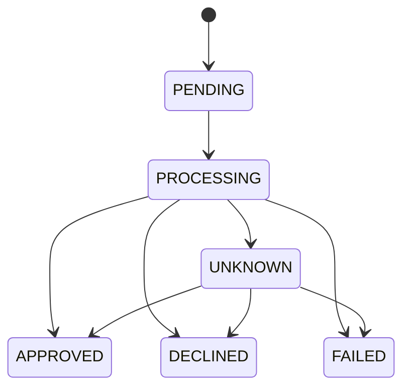

# Diseño · Fase 1

## 1. Contexto y alcance
## 2. Arquitectura (componentes y cómo se comunican)
## 3. Modelo de datos (tablas, índices y por qué)
## 4. Máquina de estados

## 5. Flujo de cobro (diagrama de secuencia)
## 6. Idempotencia (algoritmo y casos)
## 7. Manejo de errores y timeouts
## 8. Estrategia de pruebas
## 9. Decisiones y trade-offs